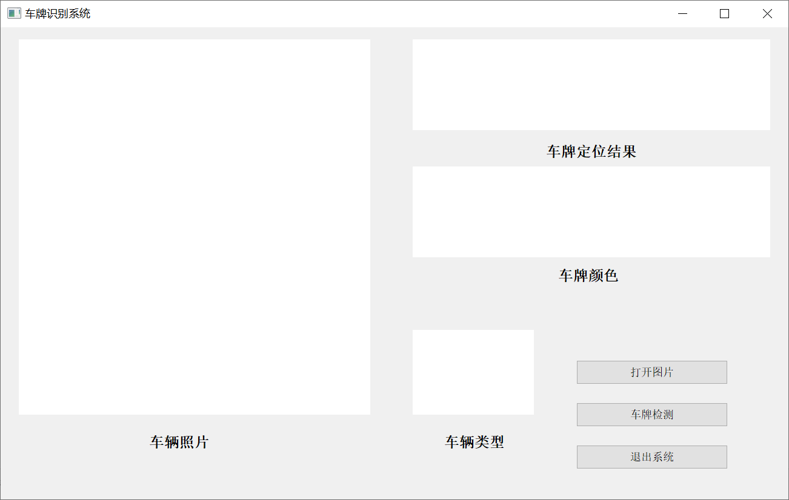
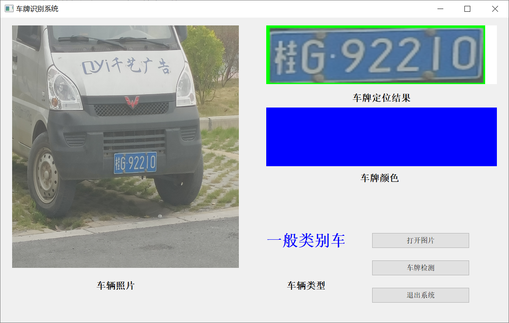

   # 车牌识别项目开发说明书


## 一.车牌识别原理

1、读取图像，对图像进行预处理，包括（具有先后顺序）：压缩图像、转换为灰度图像、灰度拉伸、开运算（去噪声）、将灰度图像和

开运算后图像取差分图、整张图像二值化、canny边缘检测、闭运算、开运算、再次开运算（这三步是为了保留车牌区域，并消除其他区

域）、定位车牌位置（找轮廓、画轮廓、取前三个轮廓进行排序、找出最大的区域）；

2、框处车牌号；

3、分割车牌号和背景，分割包括：创建掩膜、创建背景和前景、分割；

4、将分割出来的车牌进行二值化，生成黑白图像；

5、对分割出来的文字、数字和字母图像尺寸进行处理。


## **二.** **运行**方式

运行main.py文件，打开车牌识别的视图界面，点击视图界面下的“打开图片”，打开一张格式后缀为.jpg且大小在 200KB以下的带车牌的图片(图片路径应为全英文），显示图片后点击“检测车牌”，运行程序，进行车牌识别输出识别结果。识别结束点击图形菜单下的“退出系统”，结束系统.


## **三.** 开发平台/工具简介

3.1 **python 3.7.6 64-bit**

​	Python解释器易于扩展，可以使用C语言或C++（或者其他可以通过C调用的语言）扩展新的功能和数据类型。Python也可用于可定制化软件中的扩展程序语言。Python丰富的标准库，提供了适用于各个主要系统平台的源码或机器码。 

 3.2  **opencv **

​	opencv 是一个基于 BSD 许可（开源）发行的跨平台计算机视觉库，可以运行在 Linux、Windows、Android 和 Mac OS 操作系统上，轻量级而且高效由一系列C函数和少量 C++ 类构成，同时提供了 Python、Ruby、matlab 等语言的接口，实现了图像处理和计算机视觉方面的很多通用算法。

3.2 **pyqt**

​	pyqt 是一个用于创建GUI应用程序的跨平台工具包，它将Python与Qt库融为一体。也就是说，pyqt允许使用Python语言调用Qt库中的接口。这样做的最大好处就是在保留了Qt高运行效率的同时，大大提高了开发效率。因为，使用Python语言开发程序要比使用C++语言开发程序快得多。pyqt 对Qt做了完整的封装，几乎可以用pyqt做qt能做的任何事情。

3.4  **numpy**

numpy 是Python的一种开源的数值计算扩展。这种工具可用来存储和处理大型矩阵，比Python自身的嵌套列表结构要高效的多（该结构也可以用来表示矩阵（matrix）），支持大量的维度数组与矩阵运算，此外也针对数组运算提供大量的数学函数库。

3.5 **sys**

“sys”即“system”，“系统”之意。该模块提供了一些接口，用于访问 Python 解释器自身使用和维护的变量，同时模块中还提供了一部分函数，可以与解释器进行比较深度的交互。

3.6 **Visual Studio code **

​	Visual Studio Code（简称“VS Code”）是Microsoft在2015年4月30日Build开发者大会上正式宣布一个运行于 Mac OS X、Windows和 Linux 之上的，针对于编写现代Web和云应用的跨平台源代码编辑器，可在桌面上运行，并且可用于Windows，macOS和Linux。它具有对JavaScript，TypeScript和Node.js的内置支持，并具有丰富的其他语言（例如C++，C＃，Java，Python，PHP，Go）和运行时（例如.NET和Unity）扩展的生态系统。


## 四. 总体设计


系统登录界面：此模块主要负责展示系统并提供登录界面；

打开图片模块：此模块主要负责打开图片；

车牌检测模块：此模块主要负责运行程序，并利用 OpenCV 进行车牌提取；

检测结果模块：此模块主要负责利用

退出系统模块：此模块主要负责

## 五. 人员分工

<table>
	<tr>
	    <th></th>
	    <td colspan="3" align = 'center'><b>成员</b></td>
	</tr >
	<tr >
	    <td rowspan="3" align = 'center'><b>车牌识别系统开发小组</b></td>
	    <td align = 'center'><b>组长</b></td>
	    <td colspan="2" align = 'center'><b>李天朔</b></td>
	</tr>
	<tr>
	    <td align = 'center'><b>组员</b></td>
	    <td align = 'center'><b>李海柯</b></td>
	    <td align = 'center'><b>宁秀婷</b></td>
	</tr>
	<tr>
	    <td align = 'center'><b>指导老师</b></td>
	    <td align = 'center'><b>朱海荣</b></td>
	    <td align = 'center'><b>陈罗辉</b></td>
	</tr>


李海柯：参与整体设计与规划、报告的撰写，负责车牌检测算法优化。
李天朔：参与车牌检测算法编写和统筹成员工作分配。
宁秀婷：参与车牌拍照、师生对接、论文查询和页面设计。


## 六. **详细设计**

### 6.1 登陆页面

​	运行main函数所在的py文件，呈现所设计的qt界面。




### 6.2. 打开图片

  点击“打开图片”按钮，识别所打开图片


关键代码为：

```python
def openimage(self): # 打开图片
        self.imgName, imgType = QFileDialog.getOpenFileName(self, "打开图片", "", "*.jpg;;*.png;;All Files(*)")
        jpg = QtGui.QPixmap(self.imgName).scaled(self.label_1.width(), self.label_1.height())
        self.label_1.setPixmap(jpg)
```

### 6.3 检测车牌

牌照检测：从图片中找到车牌区域，用opencv-python实现

关键代码为：

```python
 def train(self):

        self.img =read_pic.rec_car(self.imgName)

        self.refreshShow()
```

### 6.4 车牌颜色、车辆类型

关键代码为：

```python
if (self.colors == 'blue'):
            QtWidgets.QApplication.processEvents()
            self.label_4.setStyleSheet("QLabel{background:blue;}"
                                 "QLabel{font-size:10px;font-weight:bold;font-family:宋体;}"
                                 )
            self.label_5.setText("一般类别车")
            self.label_5.setStyleSheet("QLabel{font-size:40px;color:blue;font-weight:bold;font-family:宋体;}")
        elif (self.colors == 'yellow'):
            QtWidgets.QApplication.processEvents()
            self.label_4.setStyleSheet("QLabel{background:yellow;}"
                                 "QLabel{font-size:10px;font-weight:bold;font-family:宋体;}"
                                 )
            self.label_5.setText("特殊用途车")
            self.label_5.setStyleSheet("QLabel{font-size:40px;color:yellow;font-weight:bold;font-family:宋体;}")
        elif (self.colors == 'green'):
            QtWidgets.QApplication.processEvents()
            self.label_4.setStyleSheet("QLabel{background:green;}"
                                 "QLabel{font-size:10px;font-weight:bold;font-family:宋体;}"
                                 )
            self.label_5.setText("新能源汽车")
            self.label_5.setStyleSheet("QLabel{font-size:40px;color:green;font-weight:bold;font-family:宋体;}")

```

### 6.5 退出系统

提供按钮运行exe程序，结束系统

关键代码为：

```python
def onClick_Button(self):  # 退出系统
        #获得Button
        sender = self.sender()
        #输出button文本
        print(sender.text())
        app = QApplication.instance()
        #退出应用程序
        app.quit()
```


### 6.6 最终结果展示



## 七 项目缺陷


在read_pic 项目中，因颜色无法统一，故不能直接读出，需变换相应颜色语句才可以准确识别。后期会进行调整并修改。

## 八 资源来源

1.开发平台工具简介参考自百度百科

2.所用识别图片来源于自己拍摄

3.运用的代码由小组成员查阅资料进行相应的应用开发


​	


​	

